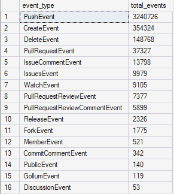
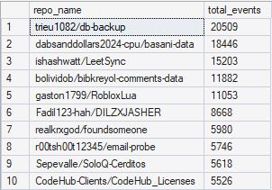
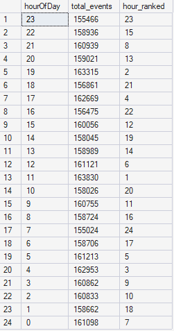

# GitHub Activity Analysis

## Project Overview

This project analyzes public GitHub event data from GH Archive to identify patterns in developer activity, repository activity, event types, and activity timing.

The data was imported into SQL Server and analyzed using aggregation, common table expressions, window functions, ranking, and percentage-of-total calculations.

## Business Questions

This project answers the following questions:

1. Which GitHub event types occurred most frequently?
2. Which repositories generated the most activity?
3. Which users generated the most events?
4. How did activity vary by hour?
5. Which event type was most common during each hour?
6. How concentrated was activity among the most active repositories?
7. What actions were most common within pull request and issue events?

## Tools Used

- SQL Server
- SQL Server Management Studio
- Python
- GH Archive
- GitHub

## Dataset

The dataset contains public GitHub events obtained from GH Archive.

Each row represents one GitHub event.

Key columns include:

- `event_id`
- `event_type`
- `created_at`
- `actor_login`
- `repo_name`
- `payload_action`

## Data Preparation

The GH Archive data was downloaded as compressed JSON files, processed using Python, converted into a tabular format, and imported into SQL Server.

The imported data was validated by checking:

- Total row count
- Unique event count
- Unique users
- Unique repositories
- Missing values
- Duplicate event identifiers

## SQL Techniques Used

- `GROUP BY`
- `COUNT`
- `COUNT(DISTINCT)`
- Common table expressions
- `ROW_NUMBER`
- Window functions
- Percentage-of-total calculations
- Date and time functions
- Conditional filtering

## Analysis

### Most Common Event Types



This query identifies the GitHub event types that occurred most frequently during the analyzed period.

### Most Active Repositories



This analysis ranks repositories according to total recorded activity.

### Activity by Hour



This query shows how public GitHub activity changed across the hours represented in the dataset.

## Key Findings

1. `PushEvent` was the most frequent event type, indicating that direct code contribution activity represented a large share of recorded events.

2. Activity was concentrated among a relatively small group of repositories, although the exact concentration depended on the limited time period analyzed.

3. GitHub activity varied by hour, suggesting identifiable periods of higher and lower public development activity.

4. Pull request and issue events showed distinct action patterns, such as opened, closed, or synchronized activity.

## Limitations

- The dataset covers only the downloaded GH Archive time period.
- The project includes public GitHub activity only.
- Programming language, stars, forks, and repository age were not available.
- Event volume should not be interpreted as a direct measure of repository quality.
- Automated users may influence user activity rankings.

## Repository Structure

```text
github-activity-analysis/
├── README.md
├── sql/
├── data/
|── images/
